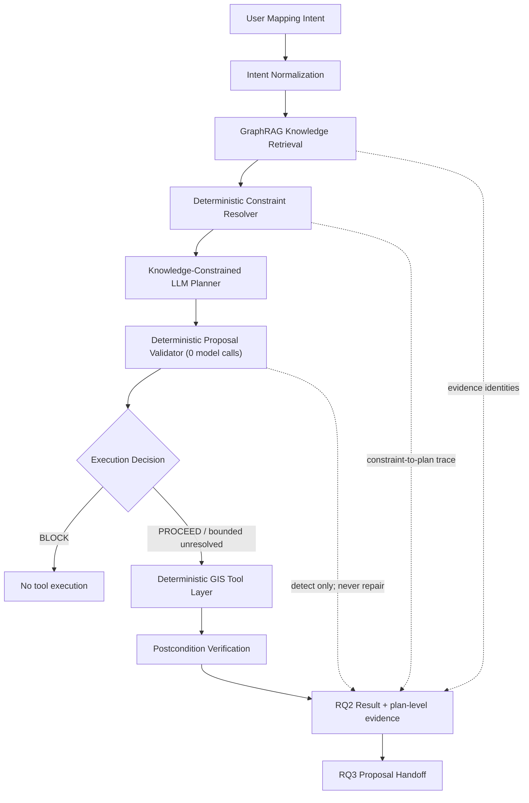
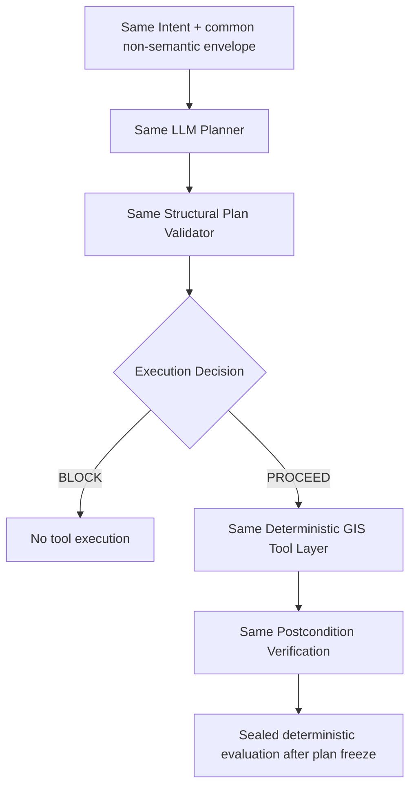

# RQ2-DEMO-00 — Constrained Agentic Execution Architecture & Acceptance Specification

Specification date: 2026-08-28 (Asia/Taipei)

## A. Verdict

**PASS WITH FINDINGS — RQ2 ARCHITECTURE FROZEN WITH BOUNDED GAPS**

The frozen architecture makes the research effect observable before execution: the controlled
comparison preserves the baseline plan, constrained plan, retrieved evidence, resolved and
unresolved constraints, constraint-to-plan trace, structural/semantic validation, plan diff,
execution receipt, and deterministic expected-versus-actual verification. Knowledge is supplied
before the constrained planner and is never used to repair a plan or result after the fact.

The findings are implementation prerequisites for RQ2-DEMO-01, not weaknesses in this freeze:

1. a reusable constraint resolver must project accepted GraphRAG evidence into the frozen
   constraint contract;
2. a genuine provider-neutral LLM plan composer must emit the frozen proposal contract;
3. the deterministic plan validator and generic tool adapters must be implemented;
4. a content-addressed, Point-geometry fire-hydrant fixture must be frozen; and
5. the accepted hydrant recipe's physical stroke, device-independent colour, and manually traced
   glyph remain review-gated, so the canonical run is limited to symbolic/derived output and must
   not claim an authoritative final render.

RQ2-DEMO-00 changes specifications only. It does not implement or start RQ2-DEMO-01.

## B. Repository identity

| Item | Frozen value / result |
|---|---|
| Canonical repository | `/Users/dongpodeng/Library/Mobile Documents/com~apple~CloudDocs/Projects/topoMap` |
| Remote | `https://github.com/dongpo/topoMap.git` |
| Selected predecessor | `d3c7dacbb1c3aea988e27909d1ebe0f0595dd3d6` (`rq1/rq1-compare-01-controlled-baselines`) |
| Branch | `rq2/rq2-demo-00-architecture-acceptance` |
| Isolated worktree | `/private/tmp/rq2-demo-00-architecture-acceptance` |
| Frozen NMA v1.0 target | `eb87bde775333811529efb6f651573ea21cf456b` (peeled target of annotated tag `nma-v1.0-final`) |
| NMA v1.0 relationship | NMA v1.0 is an exact ancestor of the selected predecessor |
| Current RQ1 relationship | selected predecessor is the latest accepted RQ1 tip and directly follows `6961b992d3fd49714fd14023afba60cba2f4e1d2` |
| Starting worktree | clean at the exact predecessor |
| Calling worktree | unrelated and dirty on `app/app-standalone-file-layout`; left untouched |
| Final SHA | reported in the post-commit console handoff; a commit cannot contain its own identity |
| Remote SHA | reported in the post-push console handoff |
| Local/upstream/remote equality | verified and reported after push |
| Final worktree | verified and reported after push |

### Predecessor selection rationale

The candidate predecessor was selected because it is the newest accepted RQ1 branch, preserves
the NMA v1.0 ancestry, contains the strongest current provider-neutral LLM, GraphRAG, retrieval
trace, validation, Agent-contract, deterministic execution, verification, provenance, and identity
foundations, and requires no new app or deployment import. Its direct delta from the accepted RQ1
validator predecessor contains only RQ1 comparison artifacts, scripts, runtime code, and tests.

The selected history inherits the already accepted AMA reconciliation with the canonical Pages
history. That history is not imported or modified by this task. No app/deployment file is in the
selected tip's direct RQ1 delta, and no app/deployment work is in the RQ2-DEMO-00 diff.

The dirty calling worktree contained unrelated untracked data and application work. It was not
cleaned, stashed, reset, deleted, or changed. The required branch was therefore created in an
isolated worktree from the exact selected predecessor.

### Frozen semantic-asset integrity

The following blob identities are identical at `nma-v1.0-final` and the selected predecessor:

| Asset | Git blob | File SHA-256 |
|---|---|---|
| `data/knowledge/nma-canonical-graph-v0.4.json` | `21219c3afffaf4ca38e65104207b630f92c9a4ab` | `4c37cc241a30c72a054da7b83cab1e2e367926e1a48f5060e6e7f0bb8f820cb4` |
| `data/extraction/portrayal-records.jsonl` | `e0ea757a05d4f4afed9ee9502d9a185cbe44c845` | `ccd732aa3996481682dfe3038d1a8fbf6e115e78a3e6bb29c0c6c4316ce200cb` |
| `data/portrayal/nlsc112v5.4/portrayal-recipe-review-batch-01-v0.4.json` | `d0029ce859739cc123d18018f467f33c049639aa` | `9ba4f3c5e9dd2acec78ab56bf9fce270efac9b8343937459a6f4b3f16830a512` |
| `src/nma/core/identity.py` | `832e78104f668432008042d04eef952c3a71c6e0` | `d9c4ac0d0d385f6942c552a0b2ffc4c12b3deb0ee876d569aeadc036b1a92e78` |

The complete `data/knowledge`, `data/extraction`, and `data/portrayal` diff from NMA v1.0 to the
selected predecessor is empty. Current RQ1 changed GraphRAG runtime behavior but did not change
the frozen graph or mapping evidence.

## C. Research definition

### Frozen research question

> Can a knowledge-grounded agent translate mapping intent into executable plans while maintaining
> explicit cartographic and geospatial constraints?

Operationally:

```text
natural-language mapping intent + retrieved geographic/cartographic knowledge
  -> explicit resolved, unresolved, and contradicted constraints
  -> machine-executable proposal
  -> deterministic GIS execution
  -> deterministic verification that execution respected the constraints
```

The research unit is **Intent → Knowledge → Constraints → Plan → Execution → Verification**.

### Primary hypothesis H2

> A knowledge-grounded mapping agent can generate executable GIS plans that preserve explicit
> geographic and cartographic constraints more reliably than an unconstrained LLM planner.

### Secondary hypothesis H2b

> The contribution of knowledge grounding is observable at the planning layer before execution,
> not merely in the final rendered result.

H2 and H2b require persisted retrieved evidence, resolved constraints, unresolved constraints,
contradictions, plan steps, tool bindings, expected postconditions, actual postconditions, and
verification results. A map image or successful tool call alone is not sufficient evidence.

## D. Why this is not tool-calling

The scenario cannot be reduced to `read → write → render`. Before any deterministic tool may run,
the system must decide and expose:

1. which feature class is supported;
2. which geometry role applies;
3. which symbolic portrayal identifiers apply;
4. which source and exact evidence records support each claim;
5. which relationship and physical-rendering details remain unresolved;
6. whether unresolved items are execution-critical for the proposed scope;
7. which bounded deterministic operations are semantically valid; and
8. which postconditions prove preservation without unexpected mutation.

Those decisions are compared at the plan layer. GIS tools receive only a validated proposal and
cannot infer classification, invent portrayal values, resolve authority, guess ProductLayer, or
call an LLM. The experiment therefore measures whether knowledge changes what the agent proposes,
not whether a model can invoke a GIS library.

## E. Canonical scenario

### User-facing input

```text
Please prepare this fire hydrant feature for authoritative map production using the applicable
national mapping rules.
```

The intent contains none of the expected class, geometry, line, colour, source, or binding values.
Both conditions receive the same content-addressed input-feature envelope and the same neutral
task instruction, plan schema, tool allowlist, model, inference parameters, and isolated output
policy.

### Accepted knowledge decisions

| Constraint class | Frozen scenario expectation | Evidence status | Execution meaning |
|---|---|---|---|
| Classification | `9350906 / 消防栓` | resolved | required symbolic classification |
| Geometry | `Point` | resolved | required input and derived geometry role |
| Portrayal line identifier | line code/style `2` | resolved as a symbolic code | required in derived semantic representation; physical width remains unresolved |
| Portrayal colour identifier | colour code `7`, observed black | resolved as a symbolic code/observation | required in derived semantic representation; device-independent profile remains unresolved |
| Source authority | exact accepted Document 01/Document 02 evidence and graph snapshot | resolved to identities, with recorded review status | required; authority status must not be overstated |
| ProductLayer binding | no confirmed value | unresolved | preserved; never guessed |
| Physical line metric | no device-independent width | unresolved activation gate | forbids authoritative render |
| Device-independent colour profile | not defined by accepted evidence | unresolved activation gate | forbids authoritative render |
| Internal glyph trace approval | pending cartographic comparison | unresolved activation gate | forbids authoritative render |

The accepted graph marks the recipe `non-executable-review-candidate`, the portrayal rule
`non-executable`, and ProductLayer mapping unresolved. RQ2 therefore may prepare only a symbolic,
identity-tracked derived representation in an isolated research output. It may not label a review
preview as authoritative production.

### ProductLayer classification

ProductLayer binding is **non-critical for the bounded symbolic/derived artifact**, because the
demo neither writes an authoritative product layer nor needs a schema-field binding to verify the
feature's class, Point geometry, and symbolic portrayal references. It is nevertheless a required
`relationship_binding` constraint with `resolution_status=unresolved` and `execution_effect=guard`.

The canonical scenario decision is therefore:

```text
PROCEED_WITH_BOUNDED_UNRESOLVED
```

Its bounds prohibit authoritative layer mutation and authoritative rendering. Any plan that names
a ProductLayer value, physical stroke width, final device colour, or approved glyph absent accepted
evidence is rejected as `CONSTRAINT_FABRICATED` or `UNRESOLVED_BINDING_GUESSED`.

## F. Controlled baseline design

### Common frozen variables

The two conditions use the same:

- user intent and input-feature identity;
- LLM/model identity, temperature, context window, output schema, and retry policy;
- neutral plan-composition instruction;
- proposal schema and deterministic tool allowlist;
- research-safe derived-output boundary;
- structural plan validator and deterministic tools; and
- sealed evaluation truth and metric implementation.

No expected semantic values appear in the user prompt or common planner instruction.

The model configuration is frozen to the accepted predecessor configuration:

| Variable | Frozen value |
|---|---|
| Provider/runtime | local Ollama through the provider-neutral `LLMAdapter` |
| Model | `qwen2.5:latest` |
| Observed Ollama model identity | `845dbda0ea48` |
| Temperature | `0` |
| Context window | `8,192` tokens |
| Reserved output | `2,048` tokens |

RQ2-DEMO-01 must record the complete observed model identity for every run. If the exact accepted
model is unavailable, the comparison blocks; it may not substitute another model in only one
condition or silently relabel a substitute as the frozen model.

### Baseline A — Unconstrained LLM Planner

```text
Intent + common fixture/tool/contract envelope
  -> same LLM planner
  -> proposal (knowledge.mode = none; empty evidence and constraint sets)
  -> shared deterministic structural validator
  -> research-safe deterministic tools
  -> deterministic verification and sealed evaluation
```

Baseline A receives no graph, text-RAG, graph identity, evidence records, expected answer values,
knowledge-derived constraint, or hidden semantic validator feedback before its plan is frozen. The
sealed evaluator may score the preserved plan/result later but may not repair, regenerate, or
silently block it based on knowledge. Common non-semantic safety guards still prevent source
mutation and arbitrary tools.

### Baseline B — Knowledge-Constrained Planner

```text
Intent + common fixture/tool/contract envelope
  -> GraphRAG retrieval
  -> deterministic evidence-to-constraint resolver
  -> same LLM planner with explicit resolved/unresolved/contradicted constraints
  -> proposal
  -> shared validator plus declared-constraint/evidence consistency checks
  -> same research-safe deterministic tools
  -> deterministic verification and sealed evaluation
```

The independent variable is the presence versus absence of explicit knowledge-derived constraints.
The constrained condition is not given an easier intent and does not receive an expected-answer
template. The resolver is deterministic and evidence-bound but does not compose or sequence the
plan; the LLM retains that role.

### Fair validation and evaluation split

The shared validator applies identical schema, hash, tool, input, mutation, precondition, and
postcondition rules. In constrained mode it additionally verifies that the proposal faithfully
uses the constraint set already supplied before planning. In baseline mode no hidden knowledge set
is injected. After both plans are immutable, a sealed deterministic evaluator scores both against
the same frozen scenario truth. Evaluator output cannot alter execution or verification.

## G. Architecture

### Knowledge-constrained condition



### Unconstrained control



### Responsibility freeze

| Layer | Owns | Must not own |
|---|---|---|
| LLM | intent interpretation, operation selection/sequencing, constraint-aware plan composition | evidence creation, constraint truth, validation, authorization, source mutation, GIS implementation |
| Knowledge layer | retrieval, evidence identity, evidence projection, resolved/unresolved/contradicted semantic constraints | plan composition, tool execution, authorization, post-hoc repair |
| Deterministic system | schema/hash validation, constraint consistency, tool allowlist, precondition gates, GIS operations, receipts, postcondition checks | semantic inference, missing-value guesses, hidden plan creation |

There is no validator-to-planner repair loop. A failed proposal is recorded as failed. A future
experimental retry, if separately frozen, must be a new attempt with a new proposal identity and
must be reported rather than replacing the failed attempt.

## H. Existing component audit

| Component | Existing owner / artifact | Disposition | RQ2 rationale |
|---|---|---|---|
| GraphRAG retrieval | `src/nma/graphrag.py::CanonicalGraphRetriever`; `AMAResearchRuntime.retrieve_with_live_interpretation` | **REUSE** | bounded candidate selection, typed expansion, citation/source identities, no arbitrary Cypher |
| Runtime graph backend | `src/nma/graph_backend.py` through `select_runtime_graph_backend_v029` | **REUSE** | preserves canonical JSON/optional read-only Neo4j selection and backend trace |
| Evidence projection | `src/nma/research_context.py::project_question_relevant_evidence` | **ADAPT** | reuse provenance-preserving projection, but RQ2 must retain activation gates and unresolved mapping state needed for constraint resolution |
| RQ1 evidence/trace | `src/nma/research_trace.py`, `src/nma/research_runtime.py` | **ADAPT** | reuse model/retrieval identity and trace patterns; add RQ2 plan/constraint events rather than altering RQ1 artifacts |
| Provider-neutral LLM | `src/nma/llm/base.py` and adapters | **REUSE** | same adapter/model can serve both conditions |
| Existing Agent intent planner | `agent_contracts/intent_planning.py` | **DO NOT USE as RQ2 planner** | deterministic three-route preview/evidence router would become a hidden rule planner and cannot express executable steps; its closed/fail-safe patterns may inform validation |
| Existing evidence-backed proposal | `agent_contracts/evidence.py`; `schemas/evidence-backed-proposal-v1.0.schema.json` | **ADAPT** | strong evidence identities, but existing contract is presentation-only and lacks constraints, tools, pre/postconditions, and RQ3 fields |
| Existing Agent governance | `agent_contracts/governance.py` | **ADAPT** | reuse canonical identity/linkage principles; RQ2 needs plan-semantic evaluation and must keep evaluation non-authoritative |
| Agent run provenance | `agent_contracts/provenance.py` | **ADAPT** | reuse complete chain and replay ideas; add planner/model, plan, constraint, allowlist, and verifier identities |
| Authorization handoff | `agent_contracts/handoff.py` | **ADAPT for RQ3** | correctly non-authoritative, but closed today to ROAD/School Hero and current presentation proposal |
| Core identity/hash | `src/nma/core/identity.py` | **REUSE** | exact Unicode-preserving sorted-key compact JSON and SHA-256 primitives |
| Generic real-layer access | `src/nma/real_layer.py` | **ADAPT** | archive inventory, reviewed extraction, feature profile, and controlled derived-output patterns are useful; profiles are domain-specific |
| ROAD execution | `src/nma/road_execution.py` | **DO NOT USE unchanged** | excellent atomic staging, identity, idempotency, derived-output, and receipt patterns; semantics and source contract are frozen to ROAD |
| ROAD verification | `src/nma/road_verification.py` | **ADAPT patterns** | exact expected/actual checks, lineage, mutation and emitted-record checks; not a generic constraint verifier |
| School Hero execution | `src/nma/school_hero_execution.py` | **DO NOT USE unchanged** | reusable Point/read/materialization patterns, but class `9920103`, layers, fields, symbol, authorization, and counts are school-specific |
| School Hero verification | `src/nma/school_hero_verification.py` | **ADAPT patterns** | lineage and unexpected-artifact checks are reusable; semantics are school-specific |
| BUILD execution/replay | `build_contracts/demo_execution.py`, `building_production_implementation.py`, activation contracts | **DO NOT USE** | polygon/building and production-activation semantics are unrelated; RQ2 must not activate BUILD |
| BUILD verification | `build_contracts/building_production_verification.py` | **ADAPT patterns only** | replay/tamper/fail-closed matrices are useful design evidence; no BUILD code path is called |
| Generic RQ2 constraint resolver | none | **MISSING** | must be implemented against the frozen constraint schema without hard-coding only the canonical six values |
| Genuine RQ2 LLM plan composer | none | **MISSING** | current LLM generates grounded answers, not executable proposal steps |
| Generic RQ2 plan validator | none | **MISSING** | specified in Section K for deterministic implementation |
| Hydrant research executor/fixture | none accepted | **MISSING** | must be a new isolated adapter/fixture, not a semantic modification to ROAD, School, or BUILD |

No duplicate production architecture is authorized. RQ2-DEMO-01 should add thin adapters around
reused primitives and keep every frozen domain engine unchanged.

### Deterministic capability inventory

| Capability | Existing evidence | Required for RQ2-DEMO-01 | Gap | Recommendation |
|---|---|---|---|---|
| Read feature | archive/layer readers and GeoJSON validation in real-layer, ROAD, School Hero | one feature by exact identity/selector | generic contract missing | adapt behind `rq2.feature.read/1.0` |
| Validate geometry type | exact Point/LineString checks in domain engines | compare observed type to constraint | generic adapter missing | adapt behind `rq2.geometry.validate/1.0` |
| Validate attributes | domain-specific exact property checks | arbitrary allowlisted path/value equality | generic adapter missing | implement `rq2.attribute.validate/1.0` |
| Derive target representation | ROAD/School/BUILD deterministic derived artifacts | symbolic hydrant class/portrayal references | hydrant adapter missing | implement `rq2.representation.derive/1.0`; no semantic inference |
| Apply bounded style mapping | domain-specific frozen portrayals | copy resolved symbolic line/colour refs | physical style unresolved | symbolic only; do not synthesize RGB/width/glyph |
| Generate derived artifact | atomic staging/receipts in domain engines | canonical JSON/GeoJSON in isolated run root | generic adapter missing | adapt `rq2.artifact.write-derived/1.0` |
| Render/replay portrayal | School/BUILD rendering patterns | optional review render | canonical physical gates unresolved | tool remains gated and unused for canonical run |
| Compare expected/actual | ROAD/School/BUILD QA checks | proposal-bound generic verifier | generic verifier missing | adapt `rq2.postconditions.verify/1.0` |
| Identity/hash | Core canonical JSON/SHA-256 | proposal, plan, input, allowlist, receipt identities | none | reuse exactly |

## I. Constraint model

The normative machine-readable schema is
`data/specifications/rq2-constraint-schema-v1.0.json`, SHA-256
`b98716048ad5448396668606869dfdcc8f6dca335a47ea9bcaa3856521ce6510`.

```json
{
  "constraint_id": "constraint:feature-class",
  "type": "classification",
  "subject": "input-feature",
  "predicate": "feature_code.equals",
  "expected_value": "9350906",
  "source_evidence_refs": ["portrayal-rule:doc01:9350906"],
  "authority_status": "authoritative_pending_review",
  "resolution_status": "resolved",
  "execution_effect": "required"
}
```

The schema is reusable across feature families. Constraint types are `classification`, `geometry`,
`portrayal`, `source_authority`, `relationship_binding`, and `execution_guard`. Values are not
limited to the hydrant scenario.

### Unresolved and contradicted semantics

- `resolved`: `expected_value` is supported by at least one declared evidence reference.
- `unresolved`: `expected_value` is JSON `null`; the planner may preserve or route around it but
  must not fill it.
- `contradicted`: at least two evidence references support incompatible values; no value is selected
  by the resolver.
- `required`: the value must be represented by the plan and satisfied after execution.
- `forbidden`: the plan must not perform or produce the named state.
- `guard`: the constraint gates a step or narrows scope.
- `informational`: it is preserved for trace/provenance but does not gate execution.

Resolution state and execution effect are independent. A required or guard constraint that is
unresolved and necessary for a proposed operation blocks that operation. An unresolved guard that
is irrelevant to a narrower safe scope produces `PROCEED_WITH_BOUNDED_UNRESOLVED`. Contradicted
execution-critical constraints always produce `BLOCK`.

The constraint resolver may normalize exact evidence into this neutral shape but must preserve all
source references and review/authority states. It has zero model calls. It does not sequence tools.

## J. Proposal/plan contract

The normative machine-readable schema is
`data/specifications/rq2-proposal-schema-v1.0.json`, SHA-256
`470bccf84046dbfe755c74a1df934d8dad75ed88b1a0a68425270394d69c00a0`.

Its required top-level fields are:

```text
proposal_id
proposal_version = rq2-proposal/1.0
proposal_hash
intent { intent_id, raw_text, normalized_goal }
knowledge { mode, evidence_refs, retrieval_identity, knowledge_snapshot_identity }
constraints { resolved, unresolved, contradicted }
decision { execution_status, reason_codes }
plan[]
required_authorizations[]
expected_postconditions[]
expected_final_state
provenance_seed
```

Every step contains:

```text
step_id
operation
tool
inputs
input_identities
preconditions
expected_postconditions
constraint_refs
trace_basis
```

`trace_basis` is a non-empty subset of `user_intent`, `knowledge_constraint`,
`deterministic_execution_requirement`, and `verification_requirement`. A syntactically executable
but unexplained step is invalid. Input identities are content-addressed; a raw arbitrary filesystem
path is not an identity.

For `BLOCK`, the executable plan must be empty. Diagnostic/non-executing analysis remains in the
decision and validation record, not as pseudo-tools. For either proceed state, each step must be
reachable through satisfied preconditions and every required authorization must name the first
step it gates.

## K. Deterministic plan validator

Contract identity: `rq2-plan-validator/1.0`. Validation model calls: **0**.

Validation is ordered and fail-closed:

1. parse finite JSON and validate `rq2-proposal/1.0` against its closed schema;
2. recompute and compare `intent_id`, `plan_identity`, and `proposal_hash`;
3. require unique proposal/step/condition/constraint identities;
4. require constraint placement to match `resolution_status` (`resolved`, `unresolved`, or
   `contradicted`) and forbid duplicate constraint IDs across arrays;
5. in GraphRAG mode, verify every evidence reference is present in the immutable retrieval package
   and snapshot; in baseline mode, require all evidence/constraint collections and knowledge
   identities to be empty/null;
6. verify each resolved constraint's normalized value and authority state against its exact source
   evidence; reject fabricated values;
7. require every plan `constraint_ref` and condition `constraint_ref` to exist;
8. require every applicable `required`, `forbidden`, or `guard` constraint to appear in at least one
   relevant precondition, step, or expected postcondition;
9. require every step's `operation` to match the exact allowlisted `tool_id`; reject unknown tools,
   shell, unrestricted Python, URLs/endpoints, and arbitrary path payloads;
10. resolve every input identity and reject undeclared/mismatched content;
11. require the mandatory preconditions in Section M and all tool-specific preconditions;
12. require step-level expected postconditions and the top-level union used for RQ3;
13. verify every step has a non-empty, truthful `trace_basis`; knowledge-derived semantic operations
    in constrained mode require at least one constraint reference;
14. reject any materialized value for an unresolved constraint, especially ProductLayer;
15. reject any operation forbidden by a constraint or by the source-mutation boundary;
16. recompute the decision: critical contradiction or failed/missing critical precondition ->
    `BLOCK`; bounded non-critical unresolved state -> `PROCEED_WITH_BOUNDED_UNRESOLVED`; otherwise
    `PROCEED`;
17. require `BLOCK` to have no executable steps; and
18. require each authorization declaration's normalized binding to match `proposal_hash` and gate a
    real step.

The validator produces an immutable check list with rule ID, expected, observed, pass/fail, and
failure taxonomy code. It never changes the proposal, constraints, plan, or result.

## L. Deterministic GIS boundary and tool allowlist

The normative allowlist is `data/specifications/rq2-tool-allowlist-v1.0.json`, SHA-256
`5793bde48cf0ad5f54f0f15e5a914d9aa53991aef2b8821164fdfa9a1b02bd7c`.

Frozen tool IDs:

| Tool | Mutation | Canonical-run use |
|---|---|---|
| `rq2.feature.read/1.0` | none | yes |
| `rq2.source-authority.validate/1.0` | none | yes |
| `rq2.geometry.validate/1.0` | none | yes |
| `rq2.attribute.validate/1.0` | none | verification |
| `rq2.representation.derive/1.0` | in-memory only | yes, symbolic refs only |
| `rq2.artifact.write-derived/1.0` | isolated derived output only | yes |
| `rq2.portrayal.render-review/1.0` | isolated review output only | **no**, blocked by unresolved physical gates |
| `rq2.postconditions.verify/1.0` | isolated verification record only | yes |

Unknown tools fail closed. Planner-generated shell commands, arbitrary Python, arbitrary SQL/Cypher,
network calls, unrestricted filesystem paths, and direct library/API invocations are not tools.
The planner selects only the semantic operation/tool ID and bounded inputs. The adapter owns the
implementation.

The LLM cannot mutate source data. The executor accepts only a schema-valid proposal whose hash,
decision, preconditions, tool bindings, and research authorization are valid. It never receives
free-form planner text as an executable command.

### Mutation boundary

RQ2 uses **temporary/derived isolated outputs**. The source feature and authoritative corpus are
read-only. Output is created beneath a new identity-tracked run directory by atomic staging. A
write target must be disjoint from all source paths. The receipt inventories every created file
and its hash; the verifier treats any extra or modified path as `UNEXPECTED_MUTATION`.

No authoritative ProductLayer, source archive, knowledge asset, production runtime, ROAD/School
Hero artifact, or BUILD production artifact may be changed. Controlled fixture mutation is not
needed. `mapping-execution` authorization is only declared for RQ3; RQ2-DEMO-01 may use a separately
defined research-derived-artifact authorization bound to the exact proposal hash.

## M. Preconditions and postconditions

### Mandatory preconditions

Every executable proposal explicitly represents:

1. input feature identity is known and content-addressed;
2. source data is readable and its observed hash matches;
3. knowledge snapshot identity is known in constrained mode;
4. all operation-critical resolved constraints are available;
5. no contradicted operation-critical constraint exists;
6. observed geometry is compatible with the operation and required geometry;
7. every tool binding exists in the exact allowlist version/hash;
8. source and output roots are disjoint and no forbidden mutation path exists;
9. the proposal hash and plan identity verify;
10. a required research authorization is valid before the first write step; and
11. unresolved guards do not affect the bounded operation being attempted.

Any failed execution-critical precondition produces `BLOCK` before mutation. A read/check failure
may produce a validation record, but no derived artifact.

### Mandatory expected postconditions

The proposal and verifier compare, at minimum:

- classification is exactly preserved/applied as proposed;
- geometry is `Point` and source coordinates/geometry are unchanged;
- symbolic line code/style is exactly the proposed resolved value;
- symbolic colour code and observed-colour statement are exactly the proposed resolved values;
- declared source/evidence identities match where observable;
- ProductLayer remains null/unresolved and no binding field/value appears;
- unresolved physical portrayal gates remain unresolved;
- every actual operation corresponds to one approved plan step/tool binding;
- the execution receipt is bound to the proposal hash;
- source artifact hashes are unchanged;
- only declared derived files exist; and
- all expected postconditions have an actual check result.

Verification is exact expected-versus-actual comparison. Successful file creation with any failed
postcondition is `POSTCONDITION_VIOLATION`, not constrained-execution success. Verification detects
but never silently rewrites.

## N. RQ2 evaluation metrics

### Primary metrics

1. **Constraint Resolution Accuracy** = correctly resolved constraints / resolvable constraints.
2. **Constraint Preservation Rate** = satisfied post-execution constraints / applicable resolved
   constraints.
3. **Plan Validity**, reported as overall binary plus:
   - syntactically executable;
   - semantically valid;
   - all required preconditions represented;
   - all required postconditions represented; and
   - no forbidden operation.
4. **Unresolved-Knowledge Preservation** = unresolved relation remained unresolved. Any fabricated
   resolution is failure.
5. **Execution Success** = deterministic execution completed as specified. This is never sufficient
   by itself.
6. **Verification Success** = actual postconditions match expected postconditions.

All metric denominators and not-applicable cases must be preserved per run. No invalid run may be
dropped from aggregates.

### Frozen primary comparison table

| Metric | LLM Planner | Knowledge-Constrained Planner |
|---|---:|---:|
| Classification correct | TBD in RQ2-DEMO-01 | TBD in RQ2-DEMO-01 |
| Geometry constraint correct | TBD | TBD |
| Line style correct | TBD | TBD |
| Color correct | TBD | TBD |
| Source-authority handling correct | TBD | TBD |
| Unresolved ProductLayer preserved | TBD | TBD |
| Executable plan | TBD | TBD |
| Semantic plan validity | TBD | TBD |
| Preconditions complete | TBD | TBD |
| Postconditions complete | TBD | TBD |
| Forbidden operation count | TBD | TBD |
| Execution success | TBD | TBD |
| Constraint preservation after execution | TBD | TBD |
| Verification success | TBD | TBD |

### Plan-level evidence

Each paired run preserves:

```text
baseline proposal and plan
knowledge-constrained proposal and plan
retrieved evidence and constraint set
constraint-to-plan trace
canonical structural plan diff
semantic plan diff
validation records
```

The analysis must identify which steps/preconditions/postconditions exist because of cartographic
knowledge, which unsafe or incomplete baseline steps are prevented, and whether ProductLayer and
physical portrayal gaps are preserved instead of guessed. Hidden chain-of-thought is neither
requested nor inferred; only observable artifacts are analyzed.

## O. Minimum RQ2-DEMO-01 test scenarios

| Case | Fixture / fault | Expected result |
|---|---|---|
| A — valid constrained execution | contract-level fixture with all applicable constraints resolved and all gates satisfied | `PROCEED`; execution and verification pass |
| B — unresolved non-critical relation | canonical hydrant constraint set; ProductLayer and physical render details remain unresolved; plan limited to symbolic derived artifact | `PROCEED_WITH_BOUNDED_UNRESOLVED`; unresolved fields remain null; no render |
| C — contradicted critical constraint | two accepted test evidence records disagree on required geometry or classification | `BLOCK`; zero tool mutation |
| D — planner omits required constraint | remove required classification/geometry/portrayal reference or postcondition | validator rejects `CONSTRAINT_OMITTED_FROM_PLAN` |
| E — planner fabricates ProductLayer | populate a ProductLayer value without evidence | validator rejects `UNRESOLVED_BINDING_GUESSED` and `CONSTRAINT_FABRICATED` |
| F — unknown tool | replace a tool ID with any unregistered command/tool | validator rejects `UNKNOWN_TOOL`; zero execution |
| G — postcondition mismatch | deterministic execution returns an artifact whose class/style/geometry differs or includes extra mutation | execution may complete; verification fails `POSTCONDITION_VIOLATION` or `UNEXPECTED_MUTATION` |

Case A is a validator/executor contract fixture and does not invent a ProductLayer value for the
canonical hydrant corpus. Case B is the canonical research scenario. Fault injection records and
gold expectations must be frozen before model outputs are observed.

## P. RQ2 → RQ3 handoff

RQ3 consumes the RQ2 proposal directly. It receives:

```text
proposal_id
proposal_hash
intent
evidence_refs
knowledge_snapshot_identity
resolved_constraints
unresolved_constraints
contradicted_constraints
execution_decision
plan
required_authorizations
expected_postconditions
expected_final_state
provenance_seed
```

RQ3 must not rerun the LLM planner, reinterpret intent, retrieve replacement evidence, reconstruct
constraints, or silently upgrade unresolved values. Any different proposal is a new proposal with a
new identity and requires new authorization.

### Canonical serialization and proposal hash

RQ2 uses the existing NMA canonical JSON profile implemented by `src/nma/core/identity.py`:

```text
UTF-8 JSON
Unicode preserved (ensure_ascii=false)
object keys sorted lexicographically
compact separators: comma and colon, no whitespace
NaN and infinity forbidden
SHA-256 lowercase hexadecimal
```

To avoid a self-reference between `proposal_hash` and authorization declarations, compute the hash
over this normalized hash basis:

1. deep-copy the complete schema-valid proposal;
2. replace top-level `proposal_hash` with 64 lowercase zeroes;
3. replace every `required_authorizations[].bound_proposal_hash` with the same 64-zero value;
4. serialize with the NMA canonical JSON profile;
5. compute SHA-256;
6. write the digest to `proposal_hash` and to every `bound_proposal_hash`;
7. recompute from the same normalized basis during validation and require exact equality.

All authorization declaration locations and all non-derived values remain covered by the digest.
The 64-zero normalization is domain-specific to `rq2-proposal/1.0` and must not be reused
implicitly by another contract.

`plan_identity` is SHA-256 of canonical JSON of the exact `plan` array. `intent_id` is
`intent:sha256:` plus SHA-256 of the exact raw intent UTF-8 bytes after no normalization. The
knowledge snapshot and each input artifact retain their own content identities.

### Required authorization declaration

RQ2 grants no RQ3 authority. Each executable proposal declares at least:

```json
{
  "authorization_type": "research-derived-artifact-execution",
  "scope": "one content-addressed fixture; isolated derived output; no source mutation; no authoritative render",
  "bound_proposal_hash": "<exact proposal_hash>",
  "required_before_step": "step:write-derived"
}
```

RQ3 may later require `mapping-execution`, but it must issue and validate that authorization under
RQ3/domain ownership. The declaration is a requirement, not a grant. Evaluation, confidence,
decision records, and handoff identities cannot become authorization.

### Provenance seed

The frozen seed includes proposal and intent identities; knowledge snapshot; evidence and
constraint identities; planner and exact model identity; plan identity; input-feature identities;
tool allowlist version and SHA-256; validator version; run identity; and explicit timestamp. RQ3
adds its authorization, consumption, execution receipt, actual postconditions, and final provenance
without replacing the RQ2 seed.

## Q. Failure taxonomy

The following observable failure codes are frozen:

```text
INTENT_AMBIGUOUS
RETRIEVAL_MISS
RETRIEVAL_CONFLICT
CONSTRAINT_UNRESOLVED
CONSTRAINT_CONTRADICTED
CONSTRAINT_OMITTED_FROM_PLAN
CONSTRAINT_FABRICATED
PLAN_SCHEMA_INVALID
UNKNOWN_TOOL
FORBIDDEN_OPERATION
PRECONDITION_MISSING
PRECONDITION_FAILED
POSTCONDITION_MISSING
EXECUTION_FAILED
POSTCONDITION_VIOLATION
UNEXPECTED_MUTATION
UNRESOLVED_BINDING_GUESSED
EVIDENCE_TRACE_BROKEN
PROPOSAL_HASH_MISMATCH
OTHER
```

Classification uses observable inputs, outputs, checks, identities, and effects only. Hidden model
reasoning is not inferred. If multiple codes apply, the record preserves the primary earliest
fail-closed gate plus all secondary observed codes. `OTHER` requires a bounded explanation and may
not replace a known code.

## R. Research limitations

- one canonical fire-hydrant feature family;
- one bounded authoritative corpus/snapshot;
- one LLM family per controlled experiment;
- a small paired comparison, not a general autonomy claim;
- deterministic, research-safe, isolated derived execution only;
- symbolic portrayal identifiers do not establish an approved physical renderer;
- accepted evidence includes explicit pending-review and non-executable states;
- no authoritative ProductLayer binding for the scenario;
- no authoritative source mutation or production workflow activation; and
- not yet an operational authoritative national-map production workflow.

These limits must appear beside RQ2-DEMO-01 results. The study may support an observable planning
effect without claiming production cartographic completeness.

## S. Semantic-change audit

| Boundary | Changed? | Evidence |
|---|---|---|
| KG | **NO** | no knowledge file in diff; frozen graph blob unchanged |
| GraphRAG retrieval semantics | **NO** | specification only; no `src/nma/graphrag.py` or runtime change |
| Mapping semantics | **NO** | no extraction/portrayal/mapping asset change |
| Model | **NO** | no model/adaptor/config change |
| Production BUILD semantics | **NO** | no BUILD file change or activation |
| ROAD semantics | **NO** | no ROAD file change |
| School Hero semantics | **NO** | no School Hero file change |
| Core semantics | **NO** | no Core file change; identity blob unchanged |
| Authoritative source data | **NO** | no dataset/source artifact change |

Only this report and three RQ2 specification JSON files are authorized in the final diff. No
production code, generated runtime artifact, evaluation result, source data, or semantic graph is
created or changed.

## T. RQ2-DEMO-01 readiness

**READY WITH BOUNDED PREREQUISITES**

Exact next implementation tasks, in order:

1. freeze a content-addressed Point fire-hydrant fixture and source selector without changing
   authoritative data;
2. implement a generic evidence-to-constraint resolver for all six constraint categories and test
   exact hydrant evidence, unresolved ProductLayer, contradictions, and review gates;
3. implement the provider-neutral LLM plan composer for `rq2-proposal/1.0`, with the same model and
   inference settings in both conditions;
4. implement `rq2-plan-validator/1.0` with zero model calls and the exact validation order in
   Section K;
5. implement thin adapters for the frozen tool allowlist, reusing identity, atomic output, and QA
   primitives while leaving ROAD, School Hero, BUILD, and Core unchanged;
6. define the proposal-hash-bound research authorization and isolated run-root lifecycle;
7. implement immutable receipts and the generic postcondition verifier;
8. freeze paired prompts, common envelope, fault fixtures A–G, sealed gold truth, and metric code
   before observing outputs;
9. execute paired baseline/constrained runs and preserve raw plans, traces, diffs, validations,
   receipts, and verification; and
10. report results without post-hoc repair, dropped failures, model substitution, or production
    claims.

The canonical run must not call `rq2.portrayal.render-review/1.0` unless all physical portrayal
gates are independently resolved in a later accepted semantic task. RQ2-DEMO-01 may not resolve
those gates itself merely to complete execution.

## Acceptance checklist

### Research framing

- [x] RQ2 operational definition frozen.
- [x] H2 and H2b frozen.
- [x] Tool calling distinguished from constrained execution.
- [x] Control baseline defined.
- [x] Canonical scenario contains no answer leakage.

### Contracts

- [x] Reusable knowledge constraint schema defined.
- [x] Unresolved/contradicted semantics defined.
- [x] Proposal/plan schema defined.
- [x] Deterministic zero-model-call validator contract defined.
- [x] Tool allowlist contract defined.
- [x] Precondition and postcondition contracts defined.
- [x] Failure taxonomy defined.

### Architecture and evaluation

- [x] LLM, knowledge, and deterministic roles separated.
- [x] No post-hoc knowledge repair.
- [x] No deterministic rule engine replaces LLM plan composition.
- [x] Source mutation boundary is isolated derived output only.
- [x] LLM-only and knowledge-constrained conditions frozen.
- [x] Metrics, plan-level evidence, and test cases A–G frozen.

### RQ3 handoff

- [x] Direct proposal contract and mandatory fields frozen.
- [x] Canonical serialization and non-circular proposal hash frozen.
- [x] Required authorization declarations frozen as non-grants.
- [x] Provenance seed frozen.

### Repository integrity

- [x] Existing architecture audited as REUSE / ADAPT / DO NOT USE / MISSING.
- [x] Frozen KG and NMA mapping semantics unchanged.
- [x] Production activation and authoritative source mutation absent.
- [x] Only RQ2-DEMO-00 report/specification files changed before finalization.
- [x] Final commit/push/equality/cleanliness are required post-document steps and are reported in
  the terminal handoff because the commit cannot embed its own SHA.

## Final acceptance answer

**Yes.** The frozen architecture exposes and binds knowledge before planning, requires every
knowledge-derived step to reference explicit constraints, preserves unresolved knowledge, compares
the constrained plan with a no-knowledge plan under the same model/tools, and verifies actual
effects against proposal-bound postconditions. Geographic/cartographic knowledge can therefore be
observed, validated, and compared as a cause of plan differences before deterministic GIS
execution.
