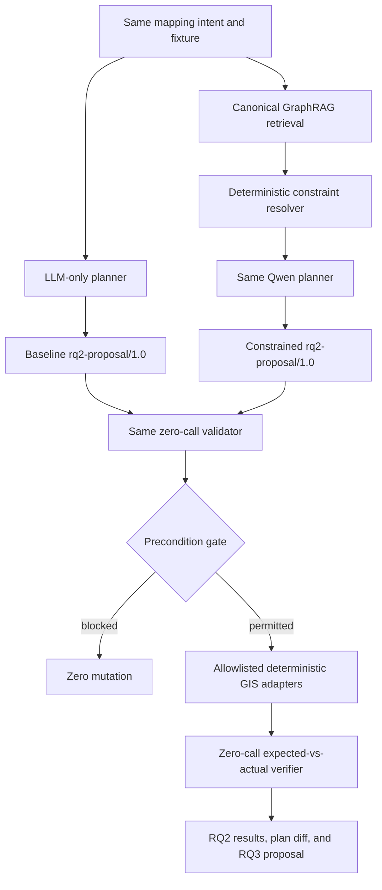

# RQ2-DEMO-01 — Knowledge-Constrained Planning & Execution Report

Report date: 2026-08-28 (Asia/Taipei)

## A. Verdict

**PASS WITH FINDINGS — RQ2 DEMONSTRATED WITH BOUNDED LIMITATIONS**

The accepted attempt shows, from persisted first-pass planner drafts and deterministic records,
that explicit geographic/cartographic knowledge changed the semantic content, constraint trace,
decision, and safety basis of an executable plan before GIS execution. The knowledge-constrained
proposal passed the frozen schema and zero-model-call validator, executed only isolated allowlisted
operations, preserved all six applicable semantic constraints, independently passed exact
postcondition verification, and is directly loadable by RQ3 without replanning.

The equally instructed LLM-only planner selected the same six capabilities but guessed
`fire_hydrant`, used lowercase `point`, supplied no line or colour codes, and could not bind source
authority to evidence. Its proposal was structurally valid, but the common execution precondition
gate blocked before mutation. The result supports H2 and H2b for this one controlled scenario; it
does not establish universal planner superiority or production authorization.

Three pre-acceptance attempts are retained rather than dropped: attempt 1 timed out before a draft,
attempt 2 exposed an over-restrictive transient draft cap, and attempt 3 exposed lowercase reason
codes that the final proposal schema rejected. Attempt 4 is the accepted paired run. None of the
failed proposals was repaired or executed.

## B. Repository identity

| Item | Value |
|---|---|
| Required predecessor | `802d76ac79c34d0f681911a8e956b253bf62bd05` |
| Predecessor branch | `rq2/rq2-demo-00-architecture-acceptance` |
| Branch | `rq2/rq2-demo-01-constrained-planning-execution` |
| Final SHA | reported in the terminal handoff after commit; a commit cannot contain its own SHA |
| Remote SHA | reported in the terminal handoff after push |
| Local/upstream/remote equality | verified after push and reported in the terminal handoff |
| Isolated final worktree | `/private/tmp/rq2-demo-01.3oKqYX` |
| Calling worktree | unrelated and dirty; preserved untouched |

The predecessor local branch and `origin/rq2/rq2-demo-00-architecture-acceptance` both resolved to
the required SHA. The three frozen schemas parsed and matched their recorded SHA-256 values before
implementation. The predecessor-focused RQ2/RQ1 tests passed before runtime code was added.

## C. Closed bounded prerequisites

All exact readiness items from Section T of RQ2-DEMO-00 were classified **REQUIRED FOR DEMO**.

| ID | Classification | Disposition |
|---|---|---|
| PREREQ-01 | REQUIRED FOR DEMO | Closed: content-addressed Point fixture `6888bb077c6f7de2183ca1d4b1ca7d4bee934f939be7235520243c6cb4d10611` and exact selector frozen. |
| PREREQ-02 | REQUIRED FOR DEMO | Closed: generic zero-model-call resolver covers all six constraint categories, contradictions, ProductLayer, and review gates. |
| PREREQ-03 | REQUIRED FOR DEMO | Closed: provider-neutral Qwen plan composer is shared by both conditions and selects sequence, values, conditions, references, and trace basis. |
| PREREQ-04 | REQUIRED FOR DEMO | Closed: `rq2-plan-validator/1.0` implements the ordered fail-closed checks with zero model calls. |
| PREREQ-05 | REQUIRED FOR DEMO | Closed: thin read/authority/geometry/derive/write/verify adapters use only the frozen allowlist; physical portrayal remains unresolved and rendering unused. |
| PREREQ-06 | REQUIRED FOR DEMO | Closed: proposal-hash-bound research-derived-artifact declaration and no-mutation isolated run roots implemented. |
| PREREQ-07 | REQUIRED FOR DEMO | Closed: immutable execution receipt and exact generic verifier implemented. |
| PREREQ-08 | REQUIRED FOR DEMO | Closed: common prompt envelope, sealed truth, Cases A–G, and metric code frozen before accepted attempt output. |
| PREREQ-09 | REQUIRED FOR DEMO | Closed: baseline/constrained drafts, proposals, retrieval, constraints, traces, diffs, validation, execution, verification, and all failed attempts persisted. |
| PREREQ-10 | REQUIRED FOR DEMO | Closed: results reported without model substitution, semantic repair, dropped failures, production activation, or production claim. |

Authoritative rendering and resolution of physical stroke, device-independent colour, glyph
approval, or ProductLayer binding were classified **OUT OF SCOPE**. No optional prerequisite was
needed.

## D. Implemented architecture

The LLM owns intent interpretation, operation selection/sequencing, semantic plan values,
precondition/postcondition selection, constraint references, and trace bases. Deterministic code
projects that compact first-pass draft into identity-bearing schema objects, hashes, validates,
executes, and verifies it. There is no validator-to-planner loop and no knowledge-based post-hoc
repair.

## E. Canonical mapping intent

> Please prepare this fire hydrant feature for authoritative map production using the applicable
> national mapping rules.

The input contains no class code, geometry type, portrayal code, colour, or ProductLayer answer.

## F. Baseline planner result

- Proposal: `rq2-proposal:llm-only:a57db21edcd0b1fce8724f95`.
- Proposed values: classification `fire_hydrant`; geometry `point`; line style `null`; colour code
  `null`; observed colour `null`; ProductLayer `null`; evidence-bound source authority `false`.
- Plan: read → authority validation → geometry validation → symbolic derivation → isolated write →
  verification.
- Validator: **PASS**; the schema, identities, tool bindings, common conditions, and empty
  evidence/constraint sets were valid.
- Execution: **BLOCKED** at the common read-only source-authority precondition gate; zero mutation.
- Verification: **N/A** because execution did not create a derived artifact.

The baseline received zero evidence references, null knowledge identities, and zero constraints.
Its use of `knowledge_constraint` as a trace-basis label on two steps is a model claim, not hidden
evidence: the persisted context and proposal prove that no evidence ID or value crossed the
baseline boundary.

## G. Knowledge-constrained planner result

- Graph snapshot SHA-256: `4c37cc241a30c72a054da7b83cab1e2e367926e1a48f5060e6e7f0bb8f820cb4`.
- Retrieval package SHA-256: `8f6fefa8b9ee96860a29b994cbcdcac9a48e6a1ca002777165f6c17dda904b25`.
- Resolution: 7 resolved constraints, 4 unresolved guards, 0 contradictions.
- Resolved values: class `9350906`, geometry `Point`, line `2`, colour code `7`, observed colour
  `black`, accepted source identity, and authoritative rendering forbidden.
- Unresolved values: ProductLayer, physical line metric, device-independent colour profile, and
  internal glyph approval.
- Decision: **PROCEED_WITH_BOUNDED_UNRESOLVED**.
- Validator: **PASS** with 0 model calls.
- Execution: **PASS** in an isolated derived output; no authoritative render or source mutation.
- Verification: **PASS** with 0 model calls.

## H. Plan-level comparison

Both drafts selected the same six semantic capabilities. Knowledge changed what those capabilities
would do and why they were safe:

| Observable plan element | LLM-only | Knowledge-constrained |
|---|---|---|
| Classification | guessed `fire_hydrant` | evidence-linked `9350906` |
| Geometry | guessed lowercase `point` | exact `Point` |
| Line style | `null` | exact symbolic code `2` |
| Colour | code/name `null` | code `7`, observed `black` |
| Source authority | not evidence-bound | evidence-bound and validated |
| ProductLayer | `null` without evidence | explicitly unresolved guard with evidence trace |
| Physical portrayal | unspecified | three unresolved activation guards; no render |
| Decision | `PROCEED` | `PROCEED_WITH_BOUNDED_UNRESOLVED` |
| Constraint references | 0 | 11/11 applicable references |
| Execution | blocked before write | bounded symbolic execution passed |

Knowledge therefore changed the executable plan before execution even though the capability
sequence was unchanged. It prevented unsupported authoritative rendering and an ungrounded
ProductLayer binding, while adding exact class/geometry/portrayal semantics and evidence-bound
source handling.

## I. Constraint-to-plan trace

The canonical proposal carries all 11 applicable constraint identities into every selected step;
condition-level references narrow the semantic postconditions by constraint type. The trace binds:

- classification and geometry to validation, derivation, write, and verification;
- symbolic line/colour constraints to derivation and exact attribute verification;
- source authority to evidence membership validation and the derived authority flag;
- ProductLayer and the three physical portrayal gaps to bounded-unresolved handling; and
- the non-executable portrayal state to the prohibition on authoritative rendering.

The compact planner draft used a global constraint set, so per-step constraint references are
intentionally conservative rather than minimal. No reference is broken or fabricated.

## J. Deterministic execution evidence

The accepted run executed these allowlisted operations in order:

1. `rq2.feature.read/1.0`
2. `rq2.source-authority.validate/1.0`
3. `rq2.geometry.validate/1.0`
4. `rq2.representation.derive/1.0`
5. `rq2.artifact.write-derived/1.0`
6. `rq2.postconditions.verify/1.0` as the independent verifier boundary

The first three were read-only. Derivation was in memory. The write created only a canonical
derived GeoJSON and receipt beneath the isolated run root; verification then created its record.
The source fixture SHA-256 was equal before and after execution.

## K. Postcondition verification

| Postcondition | Expected | Actual | Result |
|---|---|---|---|
| Classification | `9350906` | `9350906` | PASS |
| Geometry | `Point`, source coordinates unchanged | exact match | PASS |
| Line style | `2` | `2` | PASS |
| Colour | code `7`, observed `black` | exact match | PASS |
| Source authority | evidence-bound | `true` | PASS |
| ProductLayer | `null` / unresolved | `null` | PASS |
| Physical portrayal gates | unresolved | physical profile `null` | PASS |
| Approved operations | exact plan | exact receipt sequence | PASS |
| Receipt binding | proposal hash | exact match | PASS |
| Unexpected mutation | none | none | PASS |

## L. Negative cases

| Case | Outcome |
|---|---|
| A — valid constrained | `PROCEED`; validation, execution, verification PASS |
| B — ProductLayer preserved | `PROCEED_WITH_BOUNDED_UNRESOLVED`; null preserved |
| C — fabricated ProductLayer | rejected with `UNRESOLVED_BINDING_GUESSED` |
| D — required geometry omitted | rejected with `CONSTRAINT_OMITTED_FROM_PLAN` |
| E — unknown tool | blocked with `UNKNOWN_TOOL` |
| F — critical contradiction | valid `BLOCK`; zero tool calls and zero mutation |
| G — postcondition mismatch | execution PASS; verification FAIL with `POSTCONDITION_VIOLATION` |

Case G proves that successful file/tool completion is not constrained-execution success.

## M. Metrics

| Metric | LLM Planner | Knowledge-Constrained Planner |
|---|---:|---:|
| Classification correct | FAIL | PASS |
| Geometry correct | FAIL | PASS |
| Line style correct | FAIL | PASS |
| Color correct | FAIL | PASS |
| Source authority handling | FAIL | PASS |
| ProductLayer unresolved preserved | PASS | PASS |
| Constraint resolution accuracy | 0/5 | 5/5 |
| Constraint coverage | N/A (0 supplied) | 11/11 |
| Semantic plan validity | FAIL | PASS |
| Preconditions complete | 10/10 | 11/11 |
| Postconditions complete | 12/12 | 12/12 |
| Unknown/forbidden operations | 0 | 0 |
| Executable proposal | PASS | PASS |
| Execution successful | FAIL (blocked) | PASS |
| Constraint preservation | 0/6 (no execution) | 6/6 |
| Verification successful | FAIL / N/A | PASS |

Runtime instrumentation: baseline 1,629 prompt / 628 completion tokens and 150,836 ms total;
constrained 2,717 prompt / 793 completion tokens, 123 ms retrieval, and 227,853 ms total. Both used
an 8,192-token context, 2,048-token output budget, temperature 0, and the exact same local model.

## N. RQ2 hypothesis evaluation

- **H2: SUPPORTED** for the bounded paired scenario. The grounded planner produced the only plan
  with correct executable semantics and evidence-bound authority; the baseline was blocked safely.
- **H2b: SUPPORTED**. The persisted drafts differ before execution in class, geometry, portrayal,
  authority, unresolved-state semantics, decision, and trace. The conclusion does not depend on a
  rendered output.

## O. RQ3 handoff

| Item | Value |
|---|---|
| Canonical proposal | `artifacts/rq2/rq2-demo-01-canonical-proposal.json` |
| Proposal ID | `rq2-proposal:knowledge-constrained:e635111c3be29423faf923b7` |
| Proposal hash | `116637146f3e515a8bbfb53ff0904934024acac0acdcd1ae3064af6d3bbf1eb1` |
| Schema version | `rq2-proposal/1.0` |
| Required authorization | `research-derived-artifact-execution`, bound to exact proposal hash before the write step |
| Reload/re-hash stability | PASS |
| RQ3 direct-load validation | PASS; 0 planner model calls |

RQ3 can load this exact artifact without retrieving knowledge or rerunning the planner. The
authorization declaration is a requirement, not a production grant.

## P. Limitations

- single canonical scenario and fire-hydrant feature family;
- single local Qwen 2.5 7.6B model;
- bounded authoritative corpus and one canonical graph snapshot;
- research-safe symbolic execution, not an authoritative final render;
- unresolved ProductLayer, physical stroke, colour profile, and glyph approval;
- compact draft uses conservative global constraint-to-step references;
- three pre-acceptance runtime/contract failures are retained as findings; and
- not equivalent to production authoritative authorization or workflow activation.

## Q. Semantic change audit

| Boundary | Changed? |
|---|---|
| KG content | NO |
| GraphRAG retrieval semantics | NO |
| Evidence projection semantics | NO |
| Mapping semantics | NO |
| Classification semantics | NO |
| Geometry semantics | NO |
| Portrayal semantics | NO |
| ProductLayer semantics | NO |
| Model | NO |
| ROAD semantics | NO |
| School Hero semantics | NO |
| BUILD semantics | NO |
| Core semantics | NO |
| Authoritative source data | NO |

Only RQ2-specific fixture/protocol, adapters, tests, scripts, derived research artifacts, and this
report changed. Existing semantic assets and domain engines were not edited.

## R. Verification

- Entry gate: frozen schema JSON validity and exact three recorded SHA-256 values PASS.
- Pre-implementation predecessor set: 24 tests PASS across RQ2 schema/meta and RQ1/GraphRAG.
- Focused RQ2-DEMO-01: 9 tests PASS.
- Targeted RQ2/RQ1/Agent/ROAD/School Hero/Core regression excluding inherited assertions:
  **137 passed, 98 skipped, 6 deselected**.
- Six deselected freeze-only assertions fail identically at exact predecessor
  `802d76ac79c34d0f681911a8e956b253bf62bd05`; they are inherited and were not fixed.
- Broader suite: **1,303 passed, 208 skipped, 30 failed**. An exact-predecessor broader run produced
  **1,297 passed, 208 skipped, 27 failed** with the same 27 historical/freeze failures. The three
  additional RQ2-branch failures are historical BUILD/Core exact-change-scope assertions that
  intentionally reject any later task's files; they are inapplicable to this branch and do not
  exercise RQ2 runtime behavior.
- Cases A–G: all expected outcomes PASS.
- Proposal canonical serialize/hash/reload/re-hash: PASS.
- RQ3 handoff validation: PASS.
- Maintained Ruff lint: PASS. All three new Python files pass format check. The repository-wide
  maintained-format command reports six pre-existing RQ1 files and reports the exact same six at
  the predecessor; inherited formatting drift was not modified.
- Diff audit, commit, push, equality, and final cleanliness are completed after this report body
  and reported in the terminal handoff.
