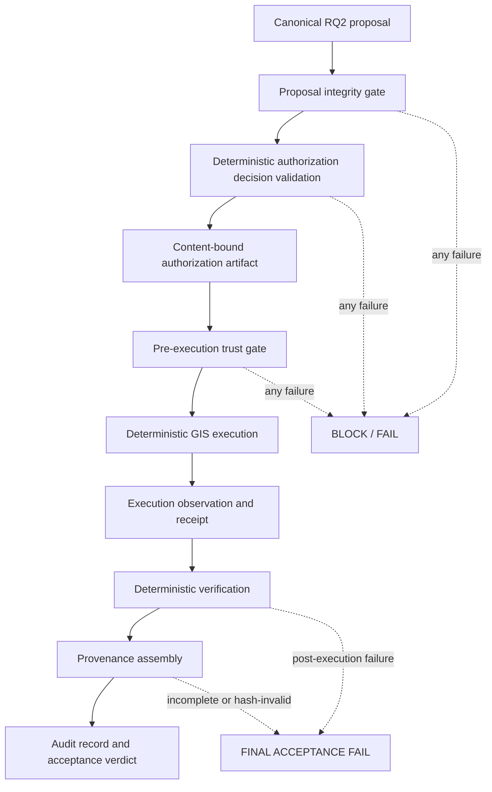

# RQ3-DEMO-00 — Authorization, Verification & Provenance Architecture Specification

## 1. Executive verdict

**Verdict: READY WITH BOUNDED PREREQUISITES.** The exact RQ2 canonical proposal can be
wrapped in a fail-closed, deterministic trust envelope without changing RQ1, RQ2, mapping, or
frozen NMA semantics. This specification freezes the RQ2→RQ3 handoff, proposal-bound
authorization, strict execution boundary, deterministic verification, content-linked provenance,
final audit record, A–L acceptance cases, acceptance function, and metrics.

The bounded prerequisites for RQ3-DEMO-01 are implementation rather than research-semantic gaps:

1. implement a domain-neutral RQ3 pre-execution gate and execution-observation record;
2. implement persistent execution-count/idempotency state for the one permitted exact replay;
3. choose a real research operator identifier and clock source (the fixture semantics here do not
   claim production PKI or external time authority);
4. execute only in a fresh isolated output root against the content-bound RQ2 fixture; and
5. implement the verifier/audit assembler directly from these closed contracts.

No LLM is permitted anywhere inside the RQ3 trust decision.

## 2. Repository and predecessor identity

| Evidence | Value |
|---|---|
| Canonical Git repository | `https://github.com/dongpo/topoMap.git` (`origin`) |
| Task worktree | `/private/tmp/rq2-demo-01.3oKqYX` |
| Required predecessor | `673bcb6efb84de2aeaac5c4b23beda364bea9e44` |
| Predecessor branch | `rq2/rq2-demo-01-constrained-planning-execution` |
| Predecessor upstream SHA | `673bcb6efb84de2aeaac5c4b23beda364bea9e44` |
| Predecessor remote SHA (`git ls-remote`) | `673bcb6efb84de2aeaac5c4b23beda364bea9e44` |
| Predecessor parent | `802d76ac79c34d0f681911a8e956b253bf62bd05` |
| Task branch | `rq3/rq3-demo-00-trust-architecture-acceptance` |
| Branch point | exact predecessor; no intervening commit |
| Initial task-worktree state | clean |

The primary iCloud checkout was on unrelated branch `app/app-standalone-file-layout` at
`ac350c8fcef6e58d820ee6da456b1d1f0ef012f6` and contained unrelated untracked paths. It was not
modified or repaired. The already-existing clean exact-predecessor worktree above was selected as
the fail-closed task boundary. Cleanliness, ancestry, proposal presence, and proposal identity were
all established there before the RQ3 branch was created.

## 3. Frozen research question and hypotheses

### RQ3

**Can authorization, deterministic verification and provenance make probabilistic AI agents
suitable for authoritative mapping workflows?**

### H3

A probabilistic AI-generated mapping proposal can be incorporated into an authoritative mapping
workflow when execution is:

1. explicitly authorized;
2. bound to an immutable proposal identity;
3. executed only through deterministic and allowlisted GIS operations;
4. deterministically verified against explicit preconditions, constraints, and postconditions; and
5. recorded through complete provenance sufficient to reconstruct what was proposed, authorized,
   executed, observed, and accepted.

### H3a — Authorization Integrity

Authorization bound to an exact canonical proposal hash prevents unauthorized execution of
modified, substituted, or scope-expanded plans.

### H3b — Deterministic Verification

Deterministic verification can detect material divergence between the authorized proposal, actual
execution, and expected postconditions without relying on an LLM judgment call.

### H3c — Provenance Completeness

A structured provenance chain can make an AI-assisted mapping action auditable by linking
`proposal → evidence → authorization → execution → verification → result`.

### H3d — Fail-Closed Trust Boundary

Missing, invalid, expired, mismatched, tampered, incomplete, or unverifiable trust artifacts block
authoritative acceptance and, where applicable, block execution before mutation.

## 4. Canonical RQ2 input identity

| Field | Frozen value |
|---|---|
| Path | `artifacts/rq2/rq2-demo-01-canonical-proposal.json` |
| Proposal ID | `rq2-proposal:knowledge-constrained:e635111c3be29423faf923b7` |
| Proposal hash | `116637146f3e515a8bbfb53ff0904934024acac0acdcd1ae3064af6d3bbf1eb1` |
| Byte SHA-256 | `8ad05eea5111a0c535be275effa6b8a6c3dce7b74c7149bf42811a1866aa4829` |
| Proposal version | `rq2-proposal/1.0` |
| Plan identity | `2bff5483934eb90a3bce3cdb9ab45e800b7f4c2deffca82e8a07fc31bec40e30` |
| Decision | `PROCEED_WITH_BOUNDED_UNRESOLVED` |

Validation reused `src/nma/rq2_demo.py::proposal_hash`. Its RQ2-frozen basis replaces the top-level
`proposal_hash` and every `required_authorizations[].bound_proposal_hash` with 64 lowercase zeroes,
then applies `src/nma/core/identity.py::canonical_json` and SHA-256. The recomputed value exactly
matched the declared hash. The proposal was not regenerated or normalized.

The four bounded unresolved constraints remain unresolved:

- `constraint:guard.color-code-7-profile`;
- `constraint:guard.internal-glyph-trace`;
- `constraint:guard.line-code-2-metric`; and
- `constraint:relationship.product_layer`.

## 5. RQ2 → RQ3 interface contract

RQ3 consumes the complete byte-identified RQ2 proposal, validates it against
`data/specifications/rq2-proposal-schema-v1.0.json`, recomputes the frozen RQ2 hash, and then maps
fields without changing them:

| Handoff concern | Exact RQ2 field(s) | RQ3 treatment |
|---|---|---|
| proposal ID | `.proposal_id` | exact authorization/execution/verification/audit binding |
| canonical identity | `.proposal_hash`, normalized RQ2 hash basis | recompute before any authorization is accepted |
| mapping intent | `.intent.intent_id`, `.intent.raw_text`, `.intent.normalized_goal` | trace only; never reinterpreted by RQ3 |
| evidence | `.knowledge.evidence_refs`, retrieval/snapshot identities | copied by reference/hash into provenance |
| resolved constraints | `.constraints.resolved[]` | verify still satisfied |
| bounded unresolved constraints | `.constraints.unresolved[]` | preserve unresolved; never infer permission |
| contradictions | `.constraints.contradicted[]` | any material contradiction is fail-closed |
| prohibited effects | `.expected_final_state.source_unchanged`, `.expected_final_state.derived_artifact.authoritative_render`, unresolved guards, `.required_authorizations[].scope` | materialized in the RQ3 policy wrapper; no RQ2 mutation |
| planned tools/order | `.plan[].step_id`, `.plan[].tool`, array order | exact ordered allowlist |
| planned operation | `.plan[].operation` | exact authorized operation set |
| parameters and inputs | `.plan[].inputs`, `.plan[].input_identities`, precondition expected values | exact proposal values; no overrides |
| requested execution scope | `.plan[].input_identities`, `.required_authorizations[].scope`, expected output fields | narrowed into the closed RQ3 authorization scope |
| expected effects | `.plan[].expected_postconditions`, `.expected_final_state` | deterministic comparison basis |
| expected postconditions | `.expected_postconditions[]` plus step postconditions | every applicable predicate must pass |
| authoritative sources | `.knowledge.knowledge_snapshot_identity`, constraint `.source_evidence_refs`, `.provenance_seed` identities | preserved as content-addressed references |

RQ2 does not contain a general-purpose structured `prohibited_actions` array, authorization issuer,
validity interval, replay counter, or final RQ3 audit contract. RQ3 therefore adds the
`rq3-trust-policy/1.0` and authorization/audit wrappers. They narrow execution and add trust
metadata; they do not repair, expand, or reinterpret RQ2 semantics.

## 6. Trust architecture and boundaries



| Boundary | May do | Must not do |
|---|---|---|
| Probabilistic upstream (RQ2) | form the already-frozen evidence-bound proposal | participate in RQ3 pass/fail decisions |
| Proposal integrity gate | schema validation and exact RQ2 hash recomputation | semantic repair or proposal regeneration |
| Authorization validator | validate exact identity, subject, time, replay, scope, tools, parameters, issuer/policy linkage | mint authority, broaden scope, call an LLM |
| Pre-execution gate | compare proposal, authorization, request, input hashes, and state | mutate data before all checks pass |
| Deterministic executor | run exact ordered allowlisted operations in an isolated root | infer parameters, substitute tools, touch source data |
| Verifier | recompute identities and compare expected/observed values | use narrative or model judgment |
| Audit assembler | validate all mandatory hash links and compute acceptance | override any failed mandatory condition |

## 7. Authorization semantics

### Subject, object, scope, and decision

- **Subject:** bounded `agent_id`, `operator_id`, and the fixed
  `rq3-demo-01-canonical-workflow`. These are research identifiers, not claims of production IAM.
- **Object:** the exact `proposal_id` and `proposal_hash`; both must match the recomputed canonical
  proposal.
- **Scope:** content-addressed dataset; logical layer; feature ID; exact operations; exact ordered
  tools; exact proposal plan identity; isolated derived-output destination; read-only source access;
  no authoritative render; the four preserved unresolved constraints; time; and execution count.
- **Decision:** `APPROVED` or `DENIED`. There is no ambiguous or narrative decision state.

The canonical research authorization permits one initial run and one exact idempotent replay. A
replay must use the same proposal, authorization, tool sequence, parameters, input/environment
identity, semantic result, result hash, and verification verdict. Generated execution,
verification, audit IDs and timestamps may differ. A third attempt is blocked.

### Invariants

1. Authorization applies only to the exact canonical proposal ID and hash.
2. Any proposal modification requires a new authorization artifact and authorization hash.
3. Scope expansion after authorization is prohibited.
4. Tools outside the exact ordered allowlist are prohibited.
5. Source mutation and authoritative rendering are prohibited.
6. Authorization is validated before any authoritative mutation or isolated output write.
7. Missing, malformed, denied, expired, replay-exhausted, or hash-invalid authorization fails closed.
8. Proposal ID/hash mismatch fails closed.
9. Parameter overrides are prohibited; actual plan identity must equal the RQ2 plan identity.
10. ProductLayer and physical portrayal gates remain unresolved.

### Authorization artifact

`data/specifications/rq3-authorization-schema-v1.0.json` is a closed JSON Schema 2020-12 contract.
`authorization_hash` is NMA canonical SHA-256 of the complete artifact excluding only
`authorization_hash`. The validity interval uses UTC closed-open semantics:
`issued_at <= execution_started_at < valid_until`. The issuer semantics are deliberately bounded;
RQ3-DEMO-00 does not introduce PKI, signatures, or an authoritative clock.

JSON Schema validity is necessary but insufficient. The trust gate must also validate the artifact
hash, exact proposal binding, policy-file byte hash, exact/narrower scope, time, subject, and replay
state.

## 8. Proposal-integrity semantics

The integrity gate performs, in order:

1. exact file presence/readability;
2. JSON and RQ2 schema validation;
3. exact `proposal_id` comparison;
4. RQ2 normalized-basis proposal-hash recomputation;
5. equality to both the proposal-declared and authorization-declared hashes;
6. equality of every RQ2 `bound_proposal_hash` declaration;
7. plan identity recomputation;
8. tool-allowlist version/hash validation; and
9. content-addressed input and knowledge-snapshot validation.

RQ2's zero-substitution self-binding rule is preserved only for the RQ2 proposal. RQ3 artifacts use
the simpler NMA canonical JSON profile with their named self-hash field excluded. A different hash
basis, Unicode normalization, float transformation, field omission, or semantic equivalence is not
accepted.

## 9. Execution boundary

The executor accepts exactly:

```text
validated canonical RQ2 proposal
+ validated matching RQ3 authorization
+ deterministic execution request/state satisfying the trust policy
```

It must never ask an LLM to revise the proposal, infer missing parameters, expand scope, substitute
tools, resolve RQ2 constraints, alter mapping semantics, mutate source data, regenerate the
proposal, or convert unresolved knowledge into permission. All writes are limited to the declared
isolated RQ3 run root. Source and output roots must be resolved and proven disjoint before a write.

The execution record contract for RQ3-DEMO-01 must include: schema/version; execution ID; proposal
ID/hash; authorization ID/hash; environment ID/hash; exact ordered tool calls with parameters,
status, and mutation flag; source hashes before/after; created result references/hashes;
`execution_success`; timestamps; executor/tool versions; and a canonical `execution_hash` excluding
only itself. This specification does not implement that runtime artifact.

## 10. Deterministic verification model

`data/specifications/rq3-verification-report-schema-v1.0.json` freezes `PASS`/`FAIL` overall
semantics and per-check `PASS`/`FAIL`/`NOT_APPLICABLE`. A final `PASS` report cannot contain a failed
check. Every check contains machine-readable expected, observed, status, and failure code.

Mandatory categories are:

- **Proposal integrity:** executed and authorized proposal ID/hash equality.
- **Authorization:** authorization ID/hash, validity, subject, replay, and policy linkage.
- **Tool integrity:** exact allowlist membership and material order.
- **Parameter integrity:** actual plan/parameters exactly equal the proposal; no substitutions.
- **Scope integrity:** only authorized dataset/layer/feature/output paths touched; source unchanged.
- **Constraint compliance:** resolved constraints remain true; prohibited actions absent; all four
  unresolved constraints remain unresolved, specifically ProductLayer.
- **Postconditions:** classification `9350906`, Point geometry/source geometry preservation, line
  code `2`, color code `7`, observed color `black`, source-authority evidence binding, symbolic
  non-authoritative output, declared files only, and proposal-bound receipt.
- **Result integrity:** every result exists and its observed hash matches the execution and audit
  references.

No LLM calls are allowed (`verifier.model_calls = 0`). The report hash excludes only
`verification_hash` and otherwise uses NMA canonical JSON/SHA-256.

### Execution success is not acceptance

The contracts deliberately keep these separate:

```text
tool returned successfully = true
deterministic verification = FAIL
authoritative acceptance = FAIL
```

`verification-failure-report.json` is the representative fixture: `execution_success` is true, but
a seeded geometry postcondition fails, so verification is `FAIL`. Even a fully formed record cannot
turn that execution into authoritative success.

## 11. Provenance model

The provenance graph is a set of content-addressed links, not a narrative:

```text
RQ2 proposal --SUPPORTED_BY--> evidence identities / knowledge snapshot
RQ2 proposal --AUTHORIZED_AS--> authorization
authorization --EXECUTED_AS--> execution record
execution --PRODUCED--> result artifacts
execution/result --VERIFIED_AS--> verification report
all validated nodes --ASSEMBLED_AS--> final audit record
```

Every link carries artifact type, artifact ID, canonical hash, and relationship. Environment and
tool/version identities live in the execution record. This answers what was proposed, which
evidence supported it, exactly what was authorized, who/what authorized it, which tools and
parameters ran, what changed, what was observed, which checks passed/failed, and whether the chain
can be reconstructed without prose.

Provenance is traceability, not authority. Missing or invalid provenance cannot retrospectively
authorize execution and always blocks final acceptance.

## 12. Audit-record model

`data/specifications/rq3-audit-record-schema-v1.0.json` requires direct proposal, evidence,
authorization, execution, verification, and result identities/hashes plus six typed provenance
links. JSON Schema `contains` constraints require every mandatory artifact type. The audit hash is
NMA canonical SHA-256 excluding only `audit_record_hash`.

For `overall_acceptance = PASS`, the schema additionally requires:

- `execution_success = true`;
- `verification_verdict = PASS`;
- `provenance_complete = true`; and
- no failure codes.

The audit assembler must independently recompute every referenced artifact hash; schema shape alone
does not establish integrity.

## 13. Canonical positive scenario

```text
exact RQ2 canonical proposal
+ schema-valid, hash-valid, time-valid, exact-scope authorization
+ exact ordered deterministic execution against the frozen fixture
+ all deterministic checks PASS
+ all mandatory provenance links present and hash-valid
= authoritative acceptance PASS
```

Success creates only a symbolic derived research artifact. `product_layer` remains `null`, physical
portrayal gates remain unresolved, authoritative render remains false, and the source fixture hash
remains unchanged.

## 14. Negative and tamper scenarios

| Case | Seed | Required deterministic outcome |
|---|---|---|
| A | exact proposal + valid authorization + exact execution + complete chain | `PASS` |
| B | authorization absent | `BLOCK_BEFORE_MUTATION`; `AUTHORIZATION_MISSING` |
| C | material proposal field changed after authorization | `BLOCK_BEFORE_MUTATION`; `PROPOSAL_HASH_MISMATCH` |
| D | feature/dataset/layer/operation exceeds scope | `BLOCK_BEFORE_MUTATION`; `AUTHORIZATION_SCOPE_MISMATCH` |
| E | authorized tool replaced | `BLOCK_BEFORE_MUTATION`; `UNAUTHORIZED_TOOL` |
| F | parameter/plan identity differs | prefer `BLOCK_BEFORE_MUTATION`; `PARAMETER_MISMATCH` |
| G | executed tool succeeds but deterministic postcondition fails | verification `FAIL`; acceptance `FAIL` |
| H | mandatory provenance link absent/invalid | acceptance `FAIL`; `PROVENANCE_INCOMPLETE` |
| I | prohibited source mutation attempted | `BLOCK_BEFORE_MUTATION`; `UNAUTHORIZED_MUTATION` |
| J | ProductLayer or physical gate treated as resolved | `BLOCK_BEFORE_MUTATION`; `UNRESOLVED_CONSTRAINT_ESCALATION` |
| K | result, execution, verification, or record content changed after hashing | integrity/provenance `FAIL`; acceptance `FAIL` |
| L | one exact authorized idempotent replay under identical bounded assumptions | same semantic result/hash and verdict; permitted IDs/timestamps may differ |

The machine-readable source of truth is `rq3-trust-policy-v1.0.json`. Representative negative
mutation recipes cover proposal-hash mismatch, authorization-scope mismatch, and incomplete
provenance.

## 15. Final authoritative acceptance function

```text
ACCEPT =
  proposal_integrity_pass
  AND authorization_pass
  AND execution_scope_pass
  AND verification_pass
  AND provenance_complete
```

Every input is mandatory and deterministic. Missing is false. Any false value yields
`FINAL ACCEPTANCE = FAIL`. No LLM, operator narrative, tool return code, or partial success can
override a failed trust condition. Pre-detectable failures block before mutation; post-execution
failures deterministically reject authoritative acceptance.

## 16. RQ3 metrics

| Metric | Definition | Canonical target |
|---|---|---:|
| Authorization enforcement rate | pre-mutation blocks / seeded cases expected to pre-block | `100%` |
| Proposal-tamper detection rate | detected post-authorization proposal mutations / seeded mutations | `100%` |
| Verification detection rate | deterministic detections / seeded execution/result violations | `100%` |
| Provenance completeness rate | present and hash-valid mandatory links / mandatory links | `100%` |
| False acceptance rate | invalid/tampered scenarios accepted / canonical negative scenarios | `0` |
| False rejection rate | canonical positive scenarios rejected / canonical positive scenarios | `0` |
| Audit reconstruction completeness | proposal/evidence/authorization/execution/verification/result all resolvable | `PASS` |

Metrics are evaluated over the frozen seeded corpus, not generalized to untested production data.

## 17. Existing-component reuse audit

| RQ3 concern | Existing component | Reusable? | Gap | Semantic risk / treatment |
|---|---|---:|---|---|
| canonical JSON/SHA-256 | `src/nma/core/identity.py` | yes, direct | none | domain-neutral; reuse exactly |
| RQ2 proposal hash | `src/nma/rq2_demo.py::proposal_hash` | yes, direct | self-binding is RQ2-specific | preserve zero-substitution basis only for RQ2 |
| proposal/schema/allowlist checks | RQ2 schema, allowlist, validator/executor | yes, adapt | no RQ3 authorization object | consume frozen proposal; do not change planner semantics |
| authorization | ROAD-03/04, School Hero, `build_contracts/demo_authorization.py` | pattern only | domain-neutral subject/scope/time/replay contract absent | reuse closed/hash-bound/single-use patterns, never domain constants |
| agent boundary | `agent_contracts/governance.py`, `agent_contracts/handoff.py` | pattern only | agent artifacts intentionally cannot grant authority | preserve separation; RQ3 authorization is independently issued |
| execution scope | ROAD and School Hero execution engines; BUILD consumption plan | pattern only | canonical RQ3 exact-plan adapter absent | use fail-closed exact bindings and isolated output roots |
| deterministic verification | `src/nma/road_verification.py`, `src/nma/school_hero_verification.py`, BUILD verification | pattern only | common RQ3 expected/observed schema absent | adapt check/hash/replay principles; keep mapping semantics RQ2-owned |
| execution receipts | RQ2 executor; ROAD/School/BUILD receipts | yes, adapt | domain-neutral RQ3 execution-record schema/engine absent | freeze required fields here; implement in DEMO-01 |
| provenance | `agent_contracts/provenance.py`, School Hero provenance, freeze manifests | pattern only | agent provenance is audit-only and domain-specific | retain audit-only semantics; link RQ3 artifacts by content hash |
| audit receipt | DEMO acceptance records and frozen manifests | pattern only | no RQ3 final Boolean acceptance record | new closed audit schema; no runtime change in DEMO-00 |
| replay/idempotency | BUILD single consumption and domain execution stores | pattern only | RQ3 permits one exact replay and needs persistent count | implement isolated RQ3 state; do not reuse domain stores semantically |

The audit found no need to duplicate Core identity primitives or to modify frozen execution
engines. Domain-specific authorizations are evidence that the pattern works, not authority for this
RQ3 scenario.

## 18. Frozen semantic boundary

RQ3-DEMO-00 changes only documentation, JSON Schemas/policy, representative fixtures, and focused
specification tests. It changes none of the following:

| Frozen area | Change |
|---|---|
| KG semantics | NO |
| GraphRAG retrieval | NO |
| evidence projection | NO |
| RQ1 behavior | NO |
| RQ2 constraint semantics | NO |
| RQ2 proposal semantics/artifacts | NO |
| classification | NO |
| geometry | NO |
| portrayal | NO |
| ProductLayer | NO |
| model configuration | NO |
| ROAD | NO |
| School Hero | NO |
| BUILD | NO |
| Core | NO |
| authoritative source data | NO |

## 19. Findings and limitations

1. The RQ2 proposal is sufficient to bind intent, evidence, constraints, tools, inputs, expected
   effects, and postconditions. A separate RQ3 wrapper is still necessary for issuer, time, replay,
   execution subject, closed scope, and final audit semantics.
2. RQ2's canonical proposal remains intentionally bounded: ProductLayer and three physical
   portrayal details are unresolved. RQ3 can enforce that boundary but cannot resolve it.
3. The authorization fixture establishes deterministic research semantics, not non-repudiation.
   Production suitability would require independently governed identity, signing/key lifecycle,
   trusted time, revocation, and durable policy administration.
4. The trust policy authorizes only an isolated derived research artifact. It is not authority to
   mutate an authoritative dataset or publish an authoritative render.
5. RQ3-DEMO-00 validates contract expressiveness and integrity, not runtime enforcement rates.
   Empirical metric values belong to RQ3-DEMO-01.
6. Exact replay promises stable semantic/result identities, not byte-identical time/ID-bearing
   records.

## 20. RQ3-DEMO-01 implementation plan

1. Add a small `nma.rq3_demo` module that reuses Core identity and imports the frozen RQ2 hash
   validator without changing RQ2.
2. Implement schema loading plus proposal, authorization, policy, time, subject, replay, input, and
   disjoint-root gates with stable failure codes.
3. Add a closed execution-observation schema and deterministic executor adapter for the exact six
   RQ2 steps; reject unknown tools/fields/parameters.
4. Persist authorization consumption count and idempotency records inside the isolated RQ3 runtime
   root.
5. Implement deterministic expected/observed checks and emit the frozen verification schema.
6. Implement provenance resolution/hash validation and final audit assembly.
7. Seed A–L fixtures, proving every pre-detectable invalid case writes zero result bytes.
8. Run one initial positive execution and one exact replay; compare required stable/differing fields.
9. Calculate the frozen metrics and issue a DEMO-01 completion report.

The implementation must not start unless it can consume the exact proposal and all four RQ3
contracts without broadening scope.

## 21. Exact acceptance criteria

- [x] exact predecessor and clean isolated task worktree established;
- [x] RQ2 proposal ID/hash recomputed exactly;
- [x] RQ3 question, H3, and H3a–H3d frozen;
- [x] RQ2→RQ3 field-level interface frozen without proposal mutation;
- [x] probabilistic/deterministic trust boundary explicit;
- [x] authorization subject/object/scope/decision/invariants frozen;
- [x] authorization schema and deterministic identity frozen;
- [x] exact proposal-hash binding and pre-execution gate order frozen;
- [x] executor prohibited from inference, substitution, scope expansion, or source mutation;
- [x] deterministic verification schema/check semantics frozen;
- [x] execution success separated from verification and authoritative acceptance;
- [x] provenance and final audit schemas/hash semantics frozen;
- [x] canonical positive and A–L negative/tamper/replay cases frozen;
- [x] deterministic Boolean acceptance function frozen;
- [x] metrics and zero false-acceptance/rejection targets frozen;
- [x] existing-component reuse/gap/semantic-risk audit complete;
- [x] frozen semantic boundary explicit;
- [x] valid and invalid representative examples created;
- [x] final focused/regression results recorded after execution;
- [x] scoped commits pushed and local/upstream/remote equality verified externally after commit.

## 22. Git and verification evidence

### Initial gate

```text
task worktree branch before RQ3 branch: rq2/rq2-demo-01-constrained-planning-execution
HEAD:                                      673bcb6efb84de2aeaac5c4b23beda364bea9e44
upstream SHA:                              673bcb6efb84de2aeaac5c4b23beda364bea9e44
remote SHA:                                673bcb6efb84de2aeaac5c4b23beda364bea9e44
worktree:                                  clean
proposal ID:                               rq2-proposal:knowledge-constrained:e635111c3be29423faf923b7
declared/recomputed proposal hash:         116637146f3e515a8bbfb53ff0904934024acac0acdcd1ae3064af6d3bbf1eb1
proposal byte SHA-256:                     8ad05eea5111a0c535be275effa6b8a6c3dce7b74c7149bf42811a1866aa4829
```

### Verification commands and results

| Scope | Result | Classification |
|---|---|---|
| RQ3 schema/fixture contract tests | `9 passed` | PASS |
| RQ3 test lint | `All checks passed` | PASS |
| RQ1/RQ2/Core/ROAD/School Hero/BUILD focused regression | `258 passed, 100 skipped` | PASS; skips are bounded private/frozen-data gates |
| Full candidate suite before commit | `1312 passed, 208 skipped, 30 failed` | 27 inherited plus 3 dirty-worktree-sensitive historical scope assertions |
| Full exact-predecessor baseline | `1306 passed, 208 skipped, 27 failed` | inherited failures reproduced before RQ3 artifacts |
| Full clean candidate after commit | `1315 passed, 208 skipped, 27 failed` | exactly the inherited failure set; 9 new RQ3 tests pass |

The 27 inherited failures are historical branch/predecessor exact-scope checks, protected-byte or
freeze-manifest expectations already divergent on the exact RQ2 predecessor, the existing
`ama-foss4g-2026-freeze` tag versus an older no-`ama-*` assertion, and historical Core residual
audit assumptions. No RQ3 production or frozen-semantic file is in their causal path. The three
additional pre-commit failures inspected untracked candidate files and cleared after the scoped
files were committed. The clean post-commit candidate has exactly the same 27 failure identities as
the exact-predecessor baseline and adds nine passing RQ3 tests; no RQ3 semantic regression exists.

Detailed commands, classifications, and the exact changed-file list are recorded in
`artifacts/rq3/rq3-demo-00-completion-report.json`. The final pushed Git SHA is intentionally
reported after commit in the task completion response; a commit cannot truthfully contain its own
SHA without a self-reference paradox.

The completion-evidence update records `local/upstream/remote equality = PASS` and `final worktree
= clean` without embedding a self-referential SHA. The exact final SHA is verified with
`git rev-parse HEAD`, `git rev-parse @{upstream}`, and `git ls-remote` and reported in the task
completion response.
