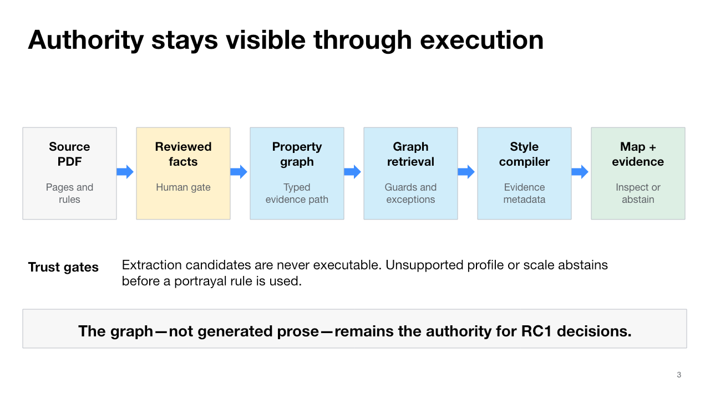
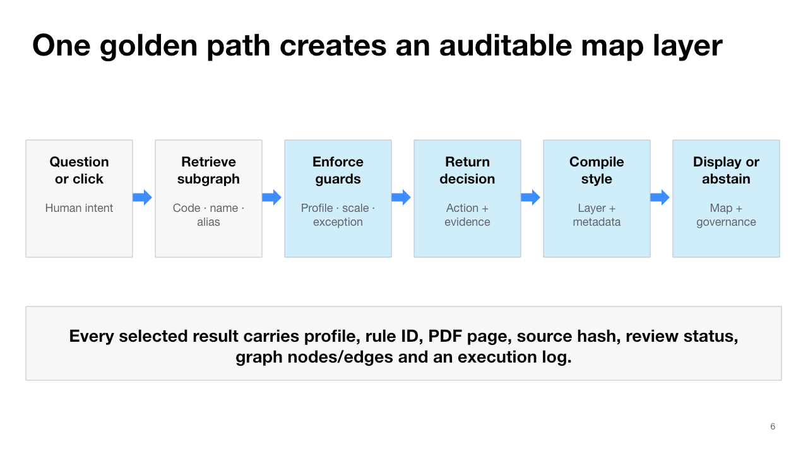

# NMA five-scene conference narrative

This D18 storyboard explains the Stable Demo RC1 as one research contribution: an
evidence-bearing, executable bridge from reviewed national portrayal specifications to auditable
map decisions. It does not present the five scenes as independent features or claim autonomous
authoritative map production.

The editable conference storyboard is
[`artifacts/presentation/nma-five-scene-storyboard-d18.pptx`](../artifacts/presentation/nma-five-scene-storyboard-d18.pptx).
Its architecture and golden-path figures are also available as standalone, screen-sized PNGs:

- [`architecture.png`](../artifacts/presentation/d18/architecture.png)
- [`golden-path.png`](../artifacts/presentation/d18/golden-path.png)

## Communication job

By the end, a FOSS4G technical audience should understand that NMA's contribution is an open,
inspectable path from reviewed specification evidence to executable portrayal and map inspection,
with authority boundaries that remain visible throughout execution.

## Storyboard

| Slide | Narrative job | Audience-facing claim | Primary evidence |
|---:|---|---|---|
| 1 | Frame the contribution | NMA connects national specification to auditable map execution. | [`ARCHITECTURE.md`](ARCHITECTURE.md) |
| 2 | Establish the problem | A symbol decision is not auditable unless its source, rule, graph path, and review state travel with it. | [`five-scene-demo.json`](../data/demo/five-scene-demo.json), [`nmaAgentDemo.html`](../nmaAgentDemo.html) |
| 3 | Explain the architecture | Reviewed facts compile into a typed graph, guarded decision, evidence-bearing MapLibre layer, and inspectable map output. | [`ARCHITECTURE.md`](ARCHITECTURE.md), `src/nma/knowledge.py`, `src/nma/portrayal.py` |
| 4 | Unify the five scenes | Each scene isolates a different capability of the same profile, graph, runner, compiler, and evidence contract. | [`five-scene-demo.json`](../data/demo/five-scene-demo.json) |
| 5 | Prepare the live segment | The five-minute sequence reveals the full path first, then four focused capabilities; pinned-cache, evidence-only, and recorded fallbacks preserve the story. | [`FIVE-SCENE-DEMO.md`](FIVE-SCENE-DEMO.md), [`STABLE-DEMO-RC1.md`](STABLE-DEMO-RC1.md) |
| 6 | Trace the golden path | One question or map click becomes a guarded decision and evidence-bearing layer, or a structured abstention. | [`ARCHITECTURE.md`](ARCHITECTURE.md), [`five-scene-demo.json`](../data/demo/five-scene-demo.json) |
| 7 | Establish presentation readiness | RC1 passed 20/20 clean resets, 10/10 cached browser rounds, and has zero unresolved blocking defects. | [`stable-rc1.json`](../data/demo/stable-rc1.json), `artifacts/rc1/` |
| 8 | State the research boundary | RC1 proves a bounded mechanism, not autonomous authority; expert review, held-out evaluation, redistribution terms, and approved deployment remain gates. | [`STABLE-DEMO-RC1.md`](STABLE-DEMO-RC1.md), [`BENCHMARK.md`](BENCHMARK.md) |
| 9 | Invite the next contribution | Independent review, held-out evaluation, and open adapters extend the bridge without hiding uncertainty. | [`FOSS4G-HIROSHIMA-2026.md`](FOSS4G-HIROSHIMA-2026.md) |

## Architecture figure

The figure preserves the implemented RC1 sequence:

1. an authoritative PDF supplies source pages and rules;
2. a human gate determines which observations may become executable;
3. the compiler creates an inspectable property graph;
4. deterministic retrieval and the portrayal agent enforce profile, scale, and exception guards;
5. the MapLibre compiler embeds evidence and graph metadata in generated layers;
6. the UI displays the map and governance evidence or returns a structured abstention.

Extraction candidates are never executable. The graph—not generated prose—remains the authority
for RC1 decisions.

## Golden-path figure

Every selected result carries the profile, rule ID, PDF page, source hash, review status, graph
nodes and edges, and an execution log. Unsupported profiles and scales abstain before a rule is
used; the post-office scene additionally demonstrates a reviewed conditional exception.

## Claim-to-evidence guardrail

| Claim family | Allowed wording | Repository evidence | Boundary |
|---|---|---|---|
| Executable knowledge | Reviewed observations compile into a portable property graph and deterministic retrieval path. | `data/extraction/portrayal-records.jsonl`, `data/knowledge/portrayal-graph.json`, `src/nma/knowledge.py` | Candidate extraction alone is not executable. |
| Agent decision | The RC1 agent returns a selected action, exception, not-found result, or abstention with evidence. | `src/nma/portrayal.py`, [`ARCHITECTURE.md`](ARCHITECTURE.md) | The graph decision does not depend on generated prose. |
| Five-scene capability | School, hydrant, police, fish pond, and post office use one shared profile and contract. | [`five-scene-demo.json`](../data/demo/five-scene-demo.json) | No sixth scene or second profile is in RC1. |
| Map execution | Graph decisions compile into MapLibre layers carrying rule, evidence, graph path, and execution metadata. | `src/nma/portrayal.py`, `artifacts/portrayal/maplibre-layers.json` | Public Pages availability is a separate deployment gate. |
| Stability | 20/20 automated rounds, 10/10 cached browser rounds, and zero blocking defects passed the D17 gate. | [`stable-rc1.json`](../data/demo/stable-rc1.json), `artifacts/rc1/automated-soak.json`, `artifacts/rc1/browser-soak.json` | These are RC1 release gates, not publication-grade cartographic validation. |
| Benchmark | The deterministic development benchmark distinguishes ungrounded, PDF-search, GraphRAG, and full-NMA controls. | [`BENCHMARK.md`](BENCHMARK.md), `artifacts/benchmark/results.json` | It is a small development set, not a named-model or held-out estimate. |

## Presentation QA

- The deck uses a 16:9, 1280 × 720 canvas and a restrained Codex Grid visual system.
- Slide titles are single-line except the deliberately large opening and closing statements.
- Architecture and golden-path labels were inspected at full-slide resolution.
- Every slide contains a `[Sources]` block in its speaker notes.
- PowerPoint rendering completed with no detected slide-canvas overflow.
- No executable RC1 behavior, dataset, graph decision, or factual claim changed in D18.
